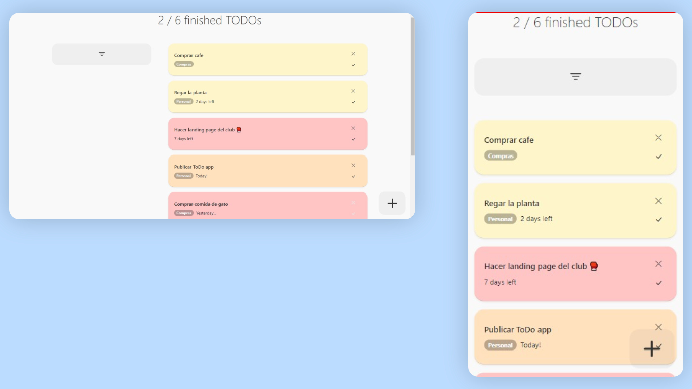

# Todo app with Create React App.

 
 
## A simple Todo app example with undelete capability — built with React :)

Try the demo at https://juanikitro.github.io/Todo-app/ .

## Stack
- Create React App
- React Content Loader
- Gh-Pages
- Bootstrap

## Quick start
```
$ git clone https://github.com/juanikitro/Todo-app.git
$ cd Todo-app
$ npm install
$ npm start
```

## Gh deploy
Package.json:
```
...
"scripts": {
		"start": "react-scripts start",
		"build": "react-scripts build",
		"test": "react-scripts test",
		"eject": "react-scripts eject",
		"predeploy": "npm run build",
		"deploy": "gh-pages -d build"
	},
  ...
	"homepage": "https://juanikitro.github.io/Todo-app/"
```
and in bash:
```
npm run deploy
```
